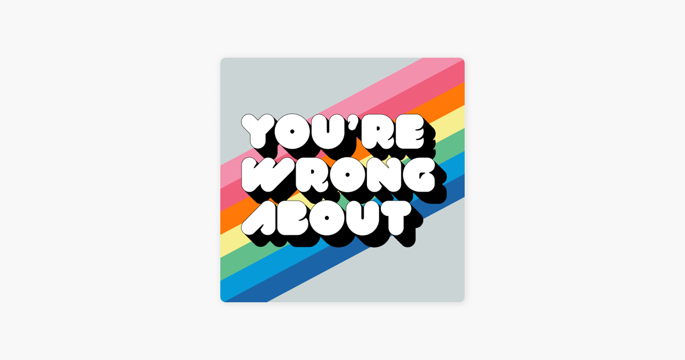

```{r setup, include=FALSE}
knitr::opts_chunk$set(echo = TRUE, warning = FALSE)
```

## It's Podcast Time

I've had a lot of fun writing a [post working with Spotify data you have to request](https://mcmullarkey.github.io/mcm-blog/posts/2022-01-04-tidy-your-spotify-data/){target="_blank"} and a [post working with Spotify data retrieved through Spotify's API.](https://mcmullarkey.github.io/mcm-blog/posts/2022-01-07-spotify-api-r/){target="_blank"} <br>
<br>
However, both of those posts focused more heavily on my music listening habits, and podcasts are a big part of my life. This post will walk through how I created a data viz based on the logo of one of my favorite podcasts: [You're Wrong About](https://open.spotify.com/show/1RefFgQB4Lrl7qczcTWA3o?si=d25c2a2485b84e1b){target="_blank"}.

## Load Packages

```{r load packages}

library(spotifyr) # API
library(tidyverse) # For tidying/plotting
library(showtext) # Custom fonts for plots
library(scales) # For adding different scales

```

## Get the Spotify Access Token

To get access to Spotify via R I highly recommend installing the [spotifyr package.](https://www.rcharlie.com/spotifyr/index.html){target="_blank"} They also have excellent instructions at that link for the other steps you need to take outside of R to connect to the Spotify API. <br> 
<br>
There are only three bits I would add: <br>
<br>
1. Once you have an app set up inside your Spotify developers account make sure you click on "Users and Access," add your Spotify account, and save that you added yourself as a "user." Otherwise you won't be able to access your own data.<br>
<br>
2. If you're using version control like Github set your client id and client secret separate from any files you push to a public repository^[Otherwise your app's api will be exposed which isn't great for security purposes] <br> 
<br>
3. Use "get_spotify_authorization_code()" rather than "get_spotify_access_token()" if you're looking to get access to your own data^[However, that's not necessary for this post since we aren't using data from any particular user]

```{r set spotify access token}

access_token <- get_spotify_authorization_code()

```

## Retrive "You're Wrong About" Info from the Spotify API

To retrieve info about You're Wrong About from the Spotify API, I first had to get the show's uinuqe ID number. If you copy the show link from within Spotify, the unique ID number is the text after the "show/" <br>
<br>
For example, the show link for You're Wrong About is https://open.spotify.com/show/1RefFgQB4Lrl7qczcTWA3o?si=1188bd404081494c and its unique ID number is "1RefFgQB4Lrl7qczcTWA3o?si=1188bd404081494c" <br>
<br>

Then we can use get_show() from the spotifyr package to get the 50 most recent episodes of the show.^[The limit on episodes happens at the Spotify API level, and if you need more episodes from one call you can try implementing something like this https://github.com/charlie86/spotifyr/issues/174]

```{r, code_folding = TRUE}

ywa <- get_show("1RefFgQB4Lrl7qczcTWA3o?si=f200249c966344bf")

ywa_df <- ywa$episodes$items

```

## Prep to Create a Plot Based on the You're Wrong About Logo

I wanted to create a plot that used the same font and colors as the You're Wrong About [logo](https://en.wikipedia.org/wiki/File:Logo_for_the_podcast_You%27re_Wrong_About.jpg). <br>
<br>


<br>
<br>
I thought the font would be the hardest part, but luckily some quick googling turned up the show [tweeting the exact font they used in their logo.](https://twitter.com/yourewrongabout/status/1257315597295083526){target="_blank"} Double good news, it's available for free [here!](https://www.fontfabric.com/fonts/val/){target="_blank"} <br>
<br>
I used the showtext package to load in the font after saving it within my project directory. You can check out instructions around using showtext for custom fonts [here.](https://cran.rstudio.com/web/packages/showtext/vignettes/introduction.html){target="_blank"} <br>
<br>
I knew there was a [tool that could create color palettes from an image directly](https://github.com/AndreaCirilloAC/paletter){target="_blank"}, but that project's Github hasn't been updated in over 2 years.^[Which is completely understandable! People shouldn't have to maintain every open source tool they create forever] I'm always wary of depending on projects that aren't actively maintained, so I decided to go a different route. <br>
<br>
I used a site that will allow you to upload an image and then [get the exact hex codes of the colors.](https://html-color-codes.info/colors-from-image/){target="_blank"} I then added those colors to plot using the scale_fill_manual() function. 

## Create a Plot Based on the You're Wrong About Logo

After those steps the "only" things that were left were some traditional data wrangling and ggplot gymnastics! You can check out the commented code if you're interested in the specifics. I ended up being curious about which episodes were longest, and it turns out YWA loves a relatively long Princess Diana episode.

```{r youre wrong about plot, code_folding = TRUE}

font_add(family = "val", regular = "VAL-UltraBlack.ttf") # Adding font for use in plots

showtext::showtext_auto() # Making sure the font will show up in RStudio

rhg_cols <- c("#1B64A8", "#079AD8", 
              "#62BE8B", "#F7EE8F", "#FF7808", "#EF5F7B", "#F390AD") # The colors from the HTML Color Codes Site

ywa_df %>% 
  arrange(desc(duration_ms)) %>% 
  slice(1:7) %>% # Getting longest 7 episodes of the most recent 50
  arrange(duration_ms) %>% # Reversing order to help with later plot aesthetics
  mutate(
         duration_mins = as.integer((duration_ms / 1000)/60), # Converting episode length from ms to mins
         name = factor(case_when(
           name == "Winter Book Club: The Amityville Horror w. Jamie Loftus (Part 2)" ~ "The Amityville Horror w. Jamie Loftus (Part 2)",
           TRUE ~ name
         )), # Shortening one really long episode name that made the plot look weird
         name=factor(name, levels=name)) %>% # Making sure we order episodes by episode length in the plot
ggplot(aes(name, duration_mins, fill = name)) +
  geom_col() +
  theme_dark() + # Give us a starting point theme
  coord_flip() + # Flip the x and y axes
  scale_fill_manual(values = rhg_cols) + # Add custom colors of bars
  labs(x = "",
       y = "Episode Length (mins)",
       title = "When It Comes to Princess Di, YWA Goes Long",
       caption = "viz: @mcmullarkey | data: spotifyr"
       ) +
  geom_text(aes(y = duration_mins, label = duration_mins), hjust = -0.4, family = "val", color = "#FFFFFF", size = 5.5) + # Adding labels with num of mins per episode
  scale_y_continuous(labels = comma, limits = c(0, 119)) +
    theme(plot.background = element_rect(fill = "#CAD4D5"), # Putting in grey background for plot
        legend.position = "none",
        text = element_text(family = "val", color = "#FFFFFF", size = 13),
        panel.background = element_rect(fill = "#CAD4D5"), # Putting in grey background for panel
        axis.text = element_text(color = "#FFFFFF"),
        axis.text.x = element_blank(), # Getting rid of x-axis text
        axis.title.x = element_text(size = 11),
        plot.title.position = "plot", # Centering plot title to entire plot
        plot.caption = element_text(hjust = 12), # Moving caption to left corner of plot
        title = element_text(size = 14),
        panel.grid.major = element_blank(), # Getting rid of gridlines pt 1
        panel.grid.minor = element_blank(), # Getting rid of gridlines pt 2
        axis.ticks = element_blank()) # Getting rid of all axis ticks 

```
## Thoughts On This Process

I really enjoyed solving this puzzle! I'd never created a plot based around a logo before, and adding the element of calling an API made things extra fun. I think in the future I'll try to make the plots more readable by taking some liberties with the exact hex colors. For example, I think making the background darker makes this image more readable compared to the exact logo colors.

```{r, improved youre wrong about plot, code_folding = TRUE}

ywa_df %>% 
  arrange(desc(duration_ms)) %>% 
  slice(1:7) %>% # Getting longest 7 episodes of the most recent 50
  arrange(duration_ms) %>% # Reversing order to help with later plot aesthetics
  mutate(
         duration_mins = as.integer((duration_ms / 1000)/60), # Converting episode length from ms to mins
         name = factor(case_when(
           name == "Winter Book Club: The Amityville Horror w. Jamie Loftus (Part 2)" ~ "The Amityville Horror w. Jamie Loftus (Part 2)",
           TRUE ~ name
         )), # Shortening one really long episode name that made the plot look weird
         name=factor(name, levels=name)) %>% # Making sure we order episodes by episode length in the plot
ggplot(aes(name, duration_mins, fill = name)) +
  geom_col() +
  theme_dark() + # Give us a starting point theme
  coord_flip() + # Flip the x and y axes
  scale_fill_manual(values = rhg_cols) + # Add custom colors of bars
  labs(x = "",
       y = "Episode Length (mins)",
       title = "When It Comes to Princess Di, YWA Goes Long",
       caption = "viz: @mcmullarkey | data: spotifyr"
       ) +
  geom_text(aes(y = duration_mins, label = duration_mins), hjust = -0.4, family = "val", color = "#FFFFFF", size = 5.5) + # Adding labels with num of mins per episode
  scale_y_continuous(labels = comma, limits = c(0, 119)) +
    theme(plot.background = element_rect(fill = "grey45"),
        legend.position = "none",
        text = element_text(family = "val", color = "#FFFFFF", size = 13),
        panel.background = element_rect(fill = "grey45"),
        axis.text = element_text(color = "#FFFFFF"),
        axis.text.x = element_blank(), # Getting rid of x-axis text
        axis.title.x = element_text(size = 11),
        plot.title.position = "plot", # Centering plot title to entire plot
        plot.caption = element_text(hjust = 12), # Moving caption to left corner of plot
        title = element_text(size = 14),
        panel.grid.major = element_blank(), # Getting rid of gridlines pt 1
        panel.grid.minor = element_blank(), # Getting rid of gridlines pt 2
        axis.ticks = element_blank()) # Getting rid of all axis ticks 

```
I'm sure there are other potential improvments too, and I look forward to learning more as I go! I'm also looking forward to continuing to leverage the Spotify API in new, interesting ways.  <br>
<br> 

If you take this template and make any of your own logo plots [please tweet them at me!](https://twitter.com/mcmullarkey){target="_blank"} I love seeing how others take, remix, and improve upon my code. I really enjoyed seeing the plots by [\@sofi_gt](https://twitter.com/sofigs_gt/status/1480254326325055507){target="_blank"} and [\@keireton](https://twitter.com/keireton/status/1480693205288960000){target="_blank"} that built upon my previous Spotify-related posts. Definitely check their work out and I look forward to seeing more!

